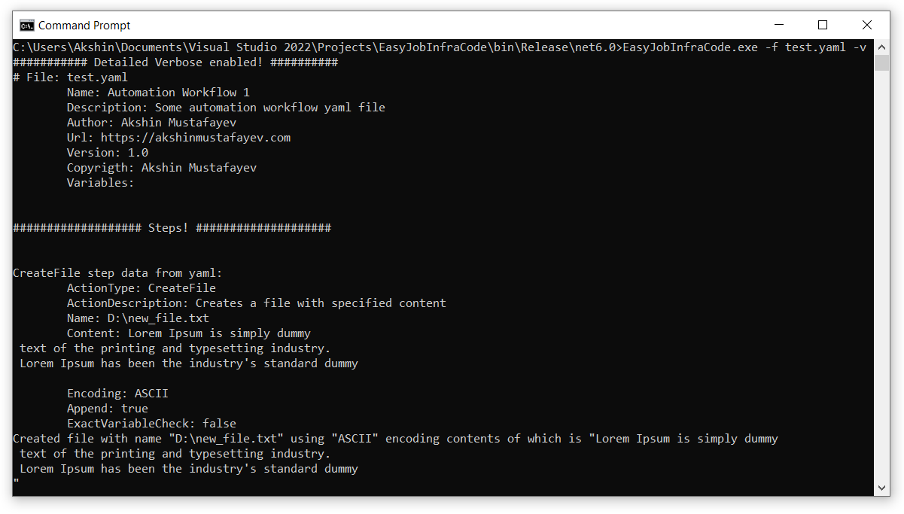
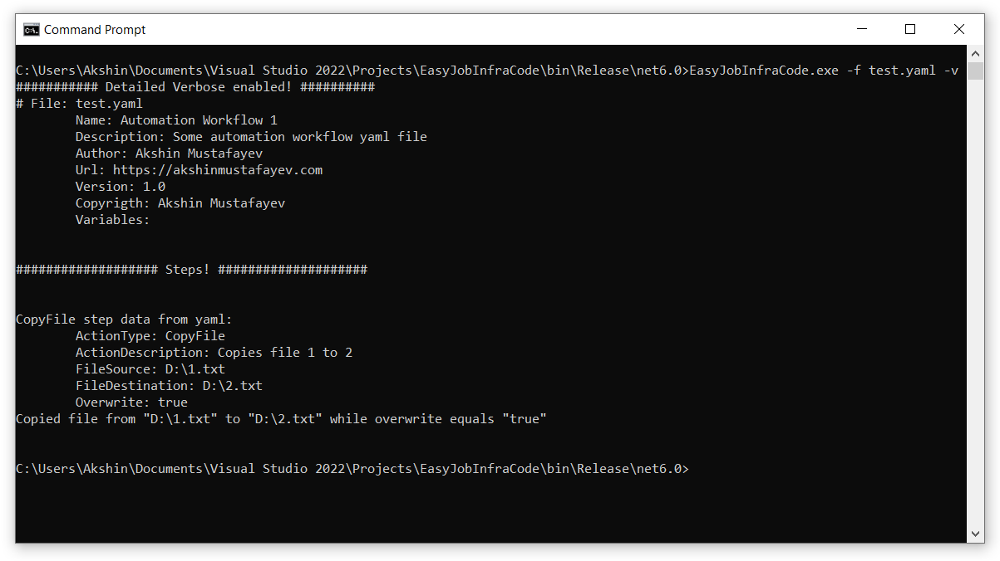

[](https://github.com/akshinmustafayev/EasyJobInfraCode)
<a href="https://img.shields.io/github/license/akshinmustafayev/EasyJobInfraCode">
  
</a>
<a href="https://img.shields.io/tokei/lines/github/akshinmustafayev/EasyJobInfraCode">
  
</a>
<a href="https://img.shields.io/github/downloads/akshinmustafayev/EasyJobInfraCode/total">
  
</a>
<a href="https://img.shields.io/github/stars/akshinmustafayev/EasyJobInfraCode?style=social">
  
</a>
<a href="https://img.shields.io/github/contributors/akshinmustafayev/EasyJobInfraCode">
  
</a> 

---

## :newspaper: Description
 EasyJobInfraCode - is a Lightweight automation tool, performs administrative tasks using __yaml__ playbooks. Check [wiki](https://github.com/akshinmustafayev/EasyJobInfraCode/wiki) for the help and documentation.

## :eye_speech_bubble: Overview
 
 

## :bulb: Requirements
[.NET 6 runtime](https://dotnet.microsoft.com/en-us/download/dotnet/6.0) must be installed

## :page_with_curl: Examples
```yaml
Name: Automation Workflow Example 1
Description: Copies files from one directory to another
Author: Akshin Mustafayev
Url: https://github.com/akshinmustafayev/EasyJobInfraCode
Version: 1.0
Copyrigth: Akshin Mustafayev
Steps:
  - ActionType: CopyFolder
    FolderSource: D:\somefolder1
    FolderDestination: D:\somefolder2
```
```yaml
Name: Automation Workflow Example 2
Description: Reads service name from file and then starts it
Author: Akshin Mustafayev
Url: https://github.com/akshinmustafayev/EasyJobInfraCode
Version: 1.0
Copyrigth: Akshin Mustafayev
Variables: [ "$var1" ]
Steps:
  - ActionType: InvokePowerShellScript
    Script: |
        $fileContent = Get-Content D:\1.txt
        Write-Host $fileContent
    PowerShellArguments: -NoLogo
    OutBuffer: $var1

  - ActionType: Service
    Name: $var1
    Action: Start
```

## :triangular_ruler: Usage
EJIC can accept the following arguments
```
  -f, --file       Required. Set file to process.

  -c, --cleanup    Required. Cleanup temp folder.

  -v, --verbose    Set output to verbose messages.

  --help           Display this help screen.

  --version        Display version information.
```

To execute yaml playbook open Command Promt and write
```
EasyJobInfraCode.exe -f "D:\path\to\yaml\playbook.yaml"
```

to see verbose output write
```
EasyJobInfraCode.exe -f "D:\path\to\yaml\playbook.yaml" -v
```

## :electric_plug: Compilation

1. Download and install Visual Studio 2022
2. Open project in Visual Studio and build it

## :dart: Contributing

Contribution is very much appreciated. Hope that this tool might be useful for you!


